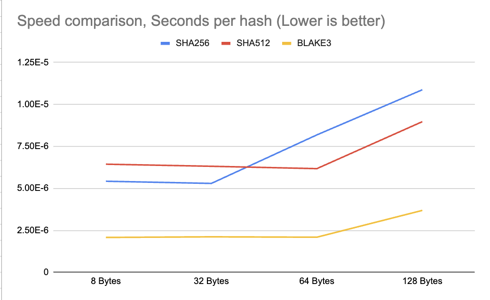

# Hashing speedtest for varying sizes of data
I am testing SHA-256, SHA512, and BLAKE3 for hashing speed. 

## Results
Tests ran on a 'M1 Pro' Macbook pro with 32GB RAM.

### SHA256:
- 8 bytes: 0.000005427 seconds per hash
- 32 bytes: 0.000005297 seconds per hash
- 64 bytes: 0.000008186 seconds per hash
- 128 bytes: 0.000010874 seconds per hash
### SHA512:
- 8 bytes: 0.000006442 seconds per hash
- 32 bytes: 0.000006318 seconds per hash
- 64 bytes: 0.000006177 seconds per hash
- 128 bytes: 0.000008975 seconds per hash
### BLAKE3:
- 8 bytes: 0.000002080 seconds per hash
- 32 bytes: 0.000002117 seconds per hash
- 64 bytes: 0.000002094 seconds per hash
- 128 bytes: 0.000003690 seconds per hash

## As a Graph

